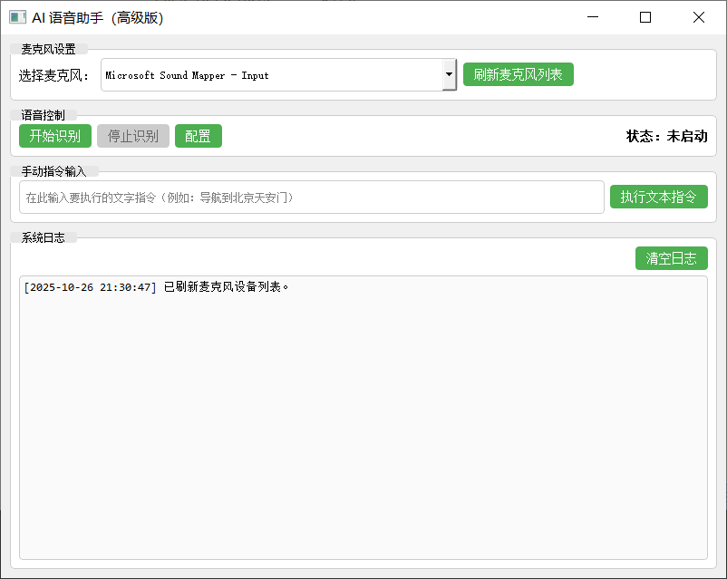

安装依赖：
pip install -r requirements.txt
在 Windows 上安装 PyAudio
pip install pipwin
pipwin install pyaudio

macOS 上可以用 brew install portaudio 然后 pip install pyaudio

Windows：双击 run_ui.bat 或 PowerShell 里 python ui/main_window.py

macOS：bash run_ui.sh 或 python3 ui/main_window.py

常见问题 & 解决办法
麦克风没被检测到：确认系统是否给 Python 进程麦克风权限（macOS 需系统偏好设置→隐私→麦克风授权）；或在 UI 点击“刷新麦克风列表”。

PyAudio 安装问题（Windows）：使用 pipwin install pyaudio 最稳妥；或从 Christoph Gohlke 的预编译 wheel 安装。

灵夕 API 调用失败：检查 config.yaml 的 LINGXI_API_KEY 是否正确、网络是否能访问该 API（有时需要代理）。

TTS 无声：确认系统音量、pyttsx3 后端驱动是否正常（Windows 通常用 SAPI5，macOS 用 NSSpeechSynthesizer）。

UI 卡顿：网络请求和识别都在后台线程；若 UI 仍卡顿，请检查是否在主线程执行了长耗时操作。

运行界面：

